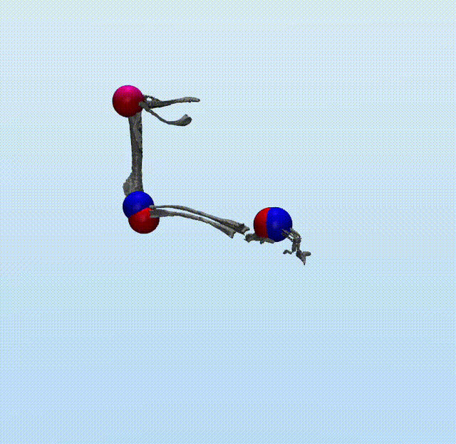
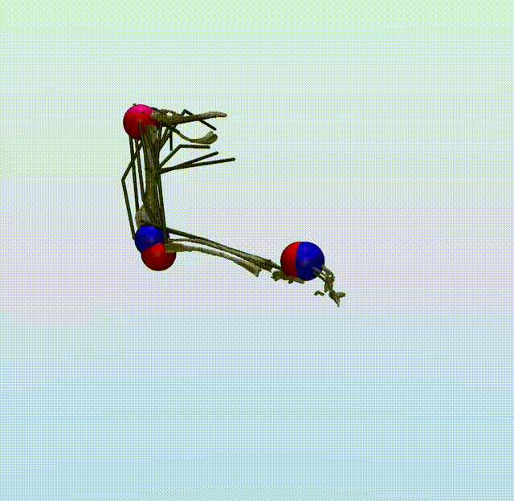

# About
### Development
- **Author:** Dylan Zelkin 
- **Employer:** University of Colorado, Denver
- **Supervisor:** Mazen Al Borno 
- **Lab:** http://cse.ucdenver.edu/~alborno/

### Description
This is an imitation learning project which uses reinforcmenent learning to train deep neural networks to control biomechanical and torque driven models by minimizing the difference between a desired kinematic motion and the actual motion enacted by a network. In this implementation of imitation learning, the network takes, as input, the joint angles and velocities, and outputs the muscle activations or torque activations respectively; there is no kinematic information given to the network, and each network learns a single unique motion.

The DRL used here is StableBaselines, and when training is completed, agents are saved in the ./agents/ folder and contain the following: training logs, the config file used when the model was created, and a zip managed by StableBaselines. Currently the only supported model architecture is a shared LSTM backbone, split off into dense layered reward and action heads.

This project was created and tested on linux (specifically ubuntu), and while it might work on other systems, is not guarenteed. 

### Examples
<table>
  <tr>
    <td align="center" width="50%">
      
       
      <b>Torque Driven Solution</b>
    </td>
    <td align="center" width="50%">
      
       
      <b>Muscle Driven Solution</b>
    </td>
  </tr>
</table>

---

# Setup
### Miniconda Installation (if not done so already)
1. Download Miniconda
    ~~~
    wget https://repo.anaconda.com/miniconda/Miniconda3-latest-Linux-x86_64.sh
    ~~~

2. Run the Installer
    ~~~
    bash Miniconda3-latest-Linux-x86_64.sh
    ~~~

### Repo Setup 
1. Install Git (if not done so already)
    ~~~
    sudo apt update && sudo apt install -y git
    ~~~

2. Clone Repo from Github and Open
    ~~~
    git clone git clone https://github.com/Al-Borno-Lab/MouseArmImitationLearning.git
    cd MouseArmImitationLearning
    ~~~

3. Create Python Environment and Activate
    ~~~
    conda env create -f environment.yml
    conda activate MouseArmImitationLearningEnv
    ~~~

4. (Optional) Install Tensorboard for Numerical Results Visualization
    ~~~
    pip install tensorboard
    ~~~

### Huggingface Installations
1. Download Huggingface Hub (if not done so already)
    ~~~
    pip install -U huggingface_hub
    ~~~

2. Download Mujoco Model and Kinematic Data
    ~~~
    hf download AlBornoLab/MouseArmModel --repo-type dataset --local-dir ./models
    hf download AlBornoLab/MouseArmKinematics --repo-type dataset --local-dir ./data
    ~~~

3. (OPTIONAL) Download Pre-Trained Torque and Muscle Models
    ~~~
    hf download AlBornoLab/MouseArmSampleMuscleAgent --repo-type model --local-dir ./agents/muscle_model
    hf download AlBornoLab/MouseArmSampleTorqueAgent --repo-type model --local-dir ./agents/torque_model
    ~~~

---

# How to Use
### Configuration Parameters
This section details which parameters can be tuned from the imitation learning environment, policy, algorithm, and training and testing scripts.

1. General
    - **name**: Name of the model (if there is no folder under ./agents/... with that name, then the train script will create one instead of continuing training; the test script will fail; if an existing model is used, all config data is pulled from it's relevant config file instead)

2. Environment
    - **model**: Mujoco model file to use
    - **kinematics**: Kinematic data file to use
    - **w_bone_diff**: A weight on the average difference between tracked bone locations in the reward function
    - **w_elbow**: A weight on the elbow in the bone average difference
    - **w_paw**: A weight on the paw in the bone average difference
    - **w_effort**: A weight on the effort used by all actuaturos in the reward function
    - **w_jitter**: A weight on the difference between qvel on the joints in the reward function
    - **w_action:** A weight on the difference between action outputs in the reward function
    - **control_dt**: Total simulation time step size per environment step
    - **n_substeps**: Simulation substeps per environment step (increasing improves simulation stability)

3. Policy
    - **lstm_hidden_size**: Number of parameters in the lstm
    - **n_lstm_layers**: Number of lstm layers
    - **net_arch_pi**: A list of layers for the action head
    - **net_arch_vf**: A list of layers for the reward head

4. Algorithm (There are more advanced terms in the config that are unlisted here, see the stablebaselines RecurrentPPO API for more info)
    - **learning_rate**: Learning rate for training
    - **n_steps**: Total number of steps per environment per iteration
    - **batch_size**: Total number of steps per batch
    - **n_epochs**: Training epochs per iteration

5. Training
    - **timesteps**: total timesteps across all training  
    - **num_envs**: number of environments running in parallel

6. Testing
    - **slowmo**: sleep time between frames (visually only), increase for greater slowmo effect

### Running the Programs
1. Train a Model
    ~~~
    python train.py
    ~~~

2. Visualize Training Results with Tensorboard
    ~~~
    PORT=$(shuf -i 6006-9000 -n 1); tensorboard --logdir ./agents --port $PORT & sleep 2 && xdg-open http://localhost:$PORT
    ~~~

3. Test a Model's Performance in a Live Viewer
    ~~~
    python test.py
    ~~~

---

# References

>Gilmer, Jesse I., Susan K. Coltman, Geraldine Cuenu, John R. Hutchinson, Daniel Huber, Abigail L. Person, and Mazen Al Borno. "A novel biomechanical model of the proximal mouse forelimb predicts muscle activity in optimal control simulations of reaching movements." Journal of neurophysiology 133, no. 4 (2025): 1266-1278.

---
