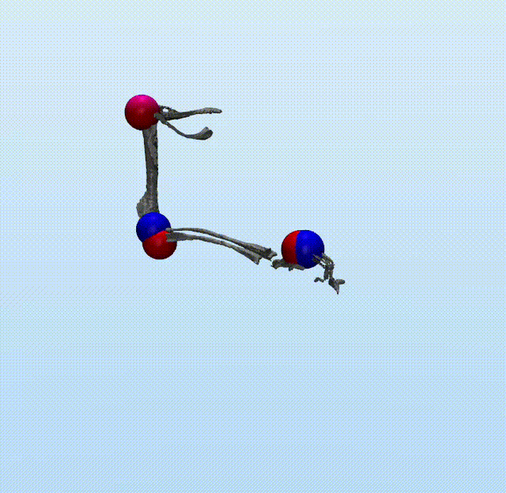
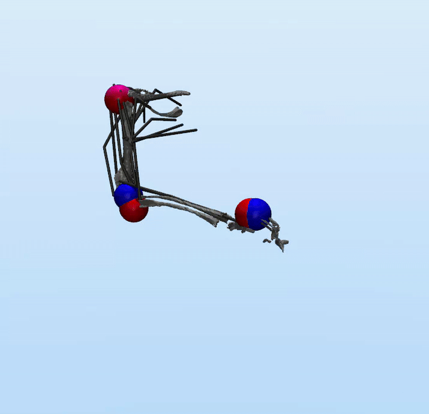

# About
### Development
- **Researcher:** Dylan Zelkin 
- **Supervisor:** Mazen Al Borno 
- **Employer:** University of Colorado, Denver
- **Lab:** http://cse.ucdenver.edu/~alborno/

### Description
This repository uses reinforcement learning to train deep neural networks to control muscle and torque driven bio-mechanical models by minimizing the difference between a target kinematic trajectory, and the actual motion enacted by a network; then, those hidden layer activation's of the artificial neural networks can be recorded and directly compared with biological neural activity to test for different types of similarity. 

### Results
<table>
  <tr>
    <td align="center" width="50%">
      <b>Torque Driven Solution</b>
       
      
    </td>
    <td align="center" width="50%">
      <b>Muscle Driven Solution</b>
       
      
    </td>
  </tr>
</table>

### Implementation Details
The mouse forelimb physics models have been adapted from the bio-mechanical mouse forelimb model from Gilmer et al. [1]; originally an OpenSim model, the torque and muscle models available here are implemented and simulated in MuJoCo [2]. The Deep Reinforcement Learning library used here is SKRL [3] which offers a variety of reliable learning algorithms; however, the main algorithm in use here is PPO [4]. The model architecture is a shared recurrent backbone split off into dense layered (FFNs) reward and action heads; the recurrent backbones that can be selected are: RNN [5], GRU [6], LSTM [7], and FFN [8] (for a non-recurrent option). 

In this implementation of imitation learning, the network takes, as input, the joint angles and velocities, and outputs the muscle activation's or torque activation's respectively where each network learns a single unique motion. In addition, there is a variation of the environment that can be setup to train a generalized kinematic model which can perform the motion of any desired kinematics on the fly by training on a large number of unique kinematics. It does this by adding a vector to the observation space with values that are the difference between the current position and a set number of future kinematic positions (see path_steps under the configuration parameters to enable this functionality). This method can also be used to increase the performance of single-reach, non-recurrent backbones by removing state ambiguity across different time steps.

The neural data available for comparison in this here is in the form of neural spikes, there is a script included to estimate the firing rate using Gaussian Smoothing [9], which is a standard form for neural comparisons. When comparing the firing rates to the recorded activation's, there are 3 main categories of comparisons: 1. Subspace-alignment, which includes CCA [10], SVCCA [11], and PWCCA [12]; 2. Representational-geometry, which includes CKA [13], RSA [14], and Procrustes [15]; 3. Predictive, which uses Ridge Regression [16].

---

# Setup
This project was created and tested on linux (specifically ubuntu), and while it might work on other systems, is not guaranteed. It is highly recommended to use a machine with a CUDA enabled device for improved training speeds.

### Miniconda Installation (if not done so already)
1. Download Miniconda
    ~~~
    wget https://repo.anaconda.com/miniconda/Miniconda3-latest-Linux-x86_64.sh
    ~~~

2. Run the Installer
    ~~~
    bash Miniconda3-latest-Linux-x86_64.sh
    ~~~

### Repo Setup 
1. Install Git (if not done so already)
    ~~~
    sudo apt update && sudo apt install -y git
    ~~~

2. Clone Repo from Github and Open
    ~~~
    git clone https://github.com/Al-Borno-Lab/MouseArmImitationLearning.git
    cd MouseArmImitationLearning
    ~~~

3. Create Python Environment and Activate
    ~~~
    conda env create -f environment.yml
    conda activate MouseArmImitationLearningEnv
    ~~~

4. (Optional) Install Tensorboard for Numerical Results Visualization
    ~~~
    pip install tensorboard
    ~~~

### Huggingface Installations
1. Install Huggingface Hub (if not done so already)
    ~~~
    pip install -U huggingface_hub
    ~~~

2. Download Mujoco Models
    ~~~
    hf download AlBornoLab/MouseArmModel --repo-type dataset --local-dir ./models
    ~~~

3. (OPTIONAL) Download Dataset: MouseArmKinematics (kinematics only)
    ~~~
    hf download AlBornoLab/MouseArmKinematics --repo-type dataset --local-dir ./MouseArmKinematics
    ~~~

4. (OPTIONAL, REQUIRES AUTHORIZATION) Download Dataset: Welle (kinematics and neural data)
    ~~~
    hf download AlBornoLab/Welle --repo-type dataset --local-dir ./Welle
    ~~~

### Google Cloud Setup (if scaling to the cloud)
1. Install GCloud (if not done so already)
    ~~~
    sudo snap install google-cloud-cli --classic
    ~~~

2. Login (this will open a browser to log in, don't worry about setting a project)
    ~~~
    gcloud init
    ~~~

3. Create a New Google Cloud Project (replace 'proj_id')
    ~~~
    PROJECT_ID="proj_id"

    gcloud projects create "$PROJECT_ID" \
        --set-as-default
    ~~~

4. Connect Billing to the Google Cloud Project (run the first command to view available ACCOUNT_ID's, replace 'account_id' in the second command)
    ~~~
    gcloud billing accounts list
    ~~~
    ~~~
    gcloud billing projects link "$PROJECT_ID" \
        --billing-account="account_id"
    ~~~

5. Enable Required APIs on the Google Cloud Project
    ~~~
    gcloud services enable \
        compute.googleapis.com \
        storage.googleapis.com \
        iam.googleapis.com \
        cloudresourcemanager.googleapis.com \
        --project="$PROJECT_ID"
    ~~~

6. Create a New Google Cloud Bucket for the Google Cloud Project (replace 'bucket_name')
    ~~~
    BUCKET="bucket_name"

    gcloud storage buckets create "gs://mouse-arm-training-dz-2026-results" \
        --project="$PROJECT_ID" \
        --uniform-bucket-level-access
    ~~~

7. Give the VM's Access to Read/Write to the Google Cloud Bucket
    ~~~
    PROJECT_NUMBER=$(gcloud projects describe "$PROJECT_ID" \
        --format="value(projectNumber)")

    VM_SERVICE_ACCOUNT="${PROJECT_NUMBER}-compute@developer.gserviceaccount.com"

    gcloud storage buckets add-iam-policy-binding "gs://$BUCKET" \
        --member="serviceAccount:$VM_SERVICE_ACCOUNT" \
        --role="roles/storage.objectAdmin"
    ~~~ 

---

# Training, Testing, and Recording a Model
### Configuration Parameters
**NOTE:** this is for the config.yml file under the imitation_learning directory
**NOTE:** model.sequence_length, algorithm.n_mini_batches and training.rollout_length must all be set together, perfectly with whole numbers and no decimals, accordingly: training.rollout_length / algorithm.n_mini_batches = model.sequence_length.

1. General
    - **name**: Name of the model 
    - **folder**: Folder where the model exists, or will be created at
    - **mode**: What mode to run the main script in ('train' to train a model, 'test' to visualize a model's performance, or 'record' to record the hidden activation's of a model)
    - **seed**: Seed used for model weight initialization and SKRL
&nbsp;
2. Environment
    - **model**: Mujoco model file to use
    - **kinematics**: Kinematic data to use (can be a file for single kinematics, or a folder containing files for generalized kinematics)
    - **train_ratio**: The training ratio used in splitting the kinematic data (only matters for generalized kinematics)
    - **seed**: Random seed used when shuffling and splitting the kinmatic data (only matters for generalized kinematics)
    - **path_steps**: The number of future time steps to sample kinematics from and include in the observation (0 for single kinematics, >1 for generalized kinematics)
    - **w_bone_diff**: A weight on the average difference between tracked bone locations in the reward function
    - **w_elbow**: A weight on the elbow in the bone average difference
    - **w_paw**: A weight on the paw in the bone average difference
    - **w_effort**: A weight on the effort used by all actuators in the reward function
    - **w_qvel**: A weight on the difference between qvel on the joints in the reward function
    - **w_qpos**: A weight on the difference between qpos on the joints in the reward function
    - **w_action:** A weight on the difference between action outputs in the reward function
    - **control_dt**: Total simulation time step size per environment step
    - **n_substeps**: Simulation sub-steps per environment step (increasing improves simulation stability)
&nbsp;
3. Model
    - **rnn_type**: Recurrent Backbone Type, choices are: lstm, gru, rnn
    - **rnn_hidden_size**: Hidden layer size in rnn
    - **rnn_layer**: Hidden layers in rnn
    - **policy_hidden_size**: Hidden layer size in policy
    - **policy_layers**: Hidden layers in policy
    - **value_hidden_size**: Hidden layer size in value
    - **value_layers**: Hidden layers in value
    - **sequence_length**: The sequence size used during training
&nbsp;
4. Algorithm (There are more advanced terms in the config that are unlisted here, see the SKRL PPO API for more info; NOTE: the clip_range's and max_grad_norm have the largest effect on training)
    - **learning_rate**: Learning rate for training
    - **n_mini_batches**: TODO
    - **n_epochs**: Training epochs per iteration
&nbsp;
5. Training
    - **timesteps**: Total time steps across all training  
    - **num_envs**: Number of environments running in parallel
    - **checkpoint_interval**: How often to save a model checkpoint (in case of failure during training) in time steps
    - **rollout_length**: Time steps per training iteration
&nbsp;
6. Testing
    - **step_delay**: Sleep time between frames (visual only), increase for greater slow-mo effect

### How to Run

1. Resize Mujoco Model to Kinematics (replace 'model.xml', 'kinematics_file.csv', and 'new_model.xml'; it is recommended to save the new model to the same folder as model, because it will need to use the same geometry folder)
    ~~~
    python imitation_learning/scale_model.py \
        model.xml \
        kinematics_file.csv \
        new_model.xml
    ~~~

2. Train a Model (make sure in config, that general.mode is set to 'train')
    ~~~
    python imitation_learning/train_test_record.py
    ~~~

3. Visualize Training Results with Tensorboard (replace 'folder' with whatever directory, or just ommit it to view all)
    ~~~
    PORT=$(shuf -i 6006-9000 -n 1); tensorboard --logdir ./folder --port $PORT & sleep 2 && xdg-open http://localhost:$PORT
    ~~~

4. Test a Model's Performance in a Live Viewer (make sure in config, that general.mode is set to 'test')
    ~~~
    python imitation_learning/train_test_record.py
    ~~~

5. Record a Model's Hidden Activation's (make sure in config, that general.mode is set to 'record')
    ~~~
    python imitation_learning/train_test_record.py
    ~~~

---

# Comparing a Model's Hidden Activation's to Neural Data
### How to Run

1. Use Neural Spike Times to Estimate Neural Activity (if not done so already) (replace 'spike_folder_or_file' with a folder of spike trains or a single file; replace 'output_folder_or_file' with a folder or file name dependent on what was passed for 'spike_folder_or_file'; replace the integer for 'num-steps' and float for 'step-dt', these values should match that of the kinematics  {if the folder method is used, these values must be the same for all of them})
    ~~~
    python analysis/firing_rate_estimation.py \
        spike_folder_or_file \
        output_folder_or_file \
        --num-steps 54 \
        --step-dt 0.00598485
    ~~~

2. Compare a Model's Hidden Activation's to Neural Activity (replace 'firing_rates_folder_or_file' and 'hidden_activations_folder_or_file', they must both be either a folder or a file, if using folders then the file names inside must match in order to actually perform the comparisons {they should by default if following all these instructions}; replace 'output_folder')
    ~~~
    python analysis/neural_comparison.py \
        firing_rates_folder_or_file \
        hidden_activations_folder_or_file \
        output_folder
    ~~~

---

# Scaling to the Cloud
### Configuration Parameters
**NOTE:** this is for the config.yml file under the cloud directory

1. Cloud
    - **project_id**: The google cloud project id
    - **bucket**: The google cloud bucket associated with the google cloud project id
&nbsp;
2. Data
    - **repository**: A hugging-face repository containing a dataset
    - **token**: A hugging-face user token for authorization
    - **kinematics**: The kinematics file/folder path inside the repository
    - **firing_rates**: (OPTIONAL, can leave blank, must be blank if spike subfields are not blank) The firing_rates file/folder path inside the repository
    - **spikes**: (OPTIONAL, can leave all subfields blank, all subfields must be blank if firing_rates is not blank; do not fill in this field)
        - **folder_or_file**: The spikes file/folder path inside the repository
        - **output_folder_or_file**: The folder or file to save the spikes newly generated firing_rates to
        - **num_steps**: The number of steps across time for the spikes (see how to run: analysis/firing_rate_estimation.py, in previous section)
        - **step_dt**: The step time (see how to run: analysis/firing_rate_estimation.py, in previous section)
&nbsp;
3. Compute
    - **region**: The region where the VM's are deployed (determines available machine_type's and gpu's)
    - **number_of_vms**: Number of concurrent VM's running in the cloud
    - **machine_type**: The machine for all VM's (also sets the CPU specs)
    - **gpu**: The GPU used be all VM's
    - **size_gb**: The disk size of all VM's (needs to be big enough to hold repo/data/results)
&nbsp;
4. Jobs (this section can take any number of entries that corresponds to any number of parameters inside the imitation_learning/config.yml file; when jobs are created it will perform a sweep so that all combinations of these entries are used for jobs; below are examples, not specific entries that must be filled)
    - **entry**: Specify only the different parameters that need to be swept through
    ~~~
    model.rnn_type:
        - ffn
        - lstm
    ~~~
    
    - **entry with parameter specification**: For each specified parameter, also specify a subset of parameters that are uniquely set ONLY when the same parent is set (these additional parameters do not create additional jobs)
    ~~~
    environment.model:
        - value: muscle
            parameters:
                algorithm.learning_rate: 3.0e-05
                algorithm.clip_range: 0.175
                algorithm.clip_range_vf: 0.175
                algorithm.max_grad_norm: 0.175
                training.timesteps: 2000000

        - value: torque
            parameters:
                algorithm.learning_rate: 1.0e-05
                algorithm.clip_range: 0.5
                algorithm.clip_range_vf: 0.5
                algorithm.max_grad_norm: 0.5
                training.timesteps: 250000
    ~~~

### How to Run
1. Deploy Workload to Cloud
    ~~~
    python cloud/submit_jobs.py
    ~~~

2. Monitor the Workload and Download the Results When Completed (replace 'cloud_results' with the desired download folder; this script can be ran or quit out of at any time without effecting the deployed jobs)
    ~~~
    python cloud/monitor_jobs.py cloud_results
    ~~~
---

# References

> [1] Gilmer, Jesse I., Susan K. Coltman, Geraldine Cuenu, John R. Hutchinson, Daniel Huber, Abigail L. Person, and Mazen Al Borno. "A novel biomechanical model of the proximal mouse forelimb predicts muscle activity in optimal control simulations of reaching movements." Journal of neurophysiology 133, no. 4 (2025): 1266-1278.

> [2] Todorov, Emanuel, Tom Erez, and Yuval Tassa. "MuJoCo: A physics engine for model-based control." *2012 IEEE/RSJ International Conference on Intelligent Robots and Systems* (2012): 5026-5033.

> [3] Serrano-Muñoz, A., Chrysostomou, D., Bøgh, S., & Arana-Arexolaleiba, N. (2022). skrl: Modular and Flexible Library for Reinforcement Learning. Journal of Machine Learning Research, 24(254), 1-9.

> [4] Schulman, John, Filip Wolski, Prafulla Dhariwal, Alec Radford, and Oleg Klimov. "Proximal Policy Optimization Algorithms." *arXiv preprint arXiv:1707.06347* (2017).

> [5] Elman, J. L. (1990). Finding structure in time. Cognitive Science, 14(2), 179–211.

> [6] Cho, K., Van Merriënboer, B., Gulcehre, C., Bahdanau, D., Bougares, F., Schwenk, H., & Bengio, Y. (2014). Learning phrase representations using RNN encoder-decoder for statistical machine translation. arXiv preprint arXiv:1406.1078.

> [7] Hochreiter, Sepp, and Jürgen Schmidhuber. "Long Short-Term Memory." *Neural Computation* 9, no. 8 (1997): 1735-1780.

> [8] Rumelhart, David E., Geoffrey E. Hinton, and Ronald J. Williams. “Learning Representations by Back-Propagating Errors.” Nature 323 (1986): 533–536.

> [9] Lehky, Sidney R. “Decoding Poisson Spike Trains by Gaussian Filtering.” Neural Computation 22, no. 5 (2010): 1245–1271. 

> [10] Hotelling, Harold. "Relations Between Two Sets of Variates." Biometrika 28, no. 3/4 (1936): 321–377.

> [11] Raghu, Maithra, Justin Gilmer, Jason Yosinski, and Jascha Sohl-Dickstein. "SVCCA: Singular Vector Canonical Correlation Analysis for Deep Learning Dynamics and Interpretability." Advances in Neural Information Processing Systems 30 (2017): 6076–6085.

> [12] Morcos, Ari S., Maithra Raghu, and Samy Bengio. "Insights on Representational Similarity in Neural Networks with Canonical Correlation." Advances in Neural Information Processing Systems 31 (2018): 5727–5736.

> [13] Kornblith, Simon, Mohammad Norouzi, Honglak Lee, and Geoffrey Hinton. “Similarity of Neural Network Representations Revisited.” In Proceedings of the 36th International Conference on Machine Learning, 3519–3529. Proceedings of Machine Learning Research 97, 2019.

> [14] Kriegeskorte, Nikolaus, Marieke Mur, and Peter A. Bandettini. “Representational Similarity Analysis—Connecting the Branches of Systems Neuroscience.” Frontiers in Systems Neuroscience 2 (2008): 4.

> [15] Schönemann, Peter H. “A Generalized Solution of the Orthogonal Procrustes Problem.” Psychometrika 31, no. 1 (1966): 1–10.

> [16] Hoerl, Arthur E., and Robert W. Kennard. “Ridge Regression: Biased Estimation for Nonorthogonal Problems.” Technometrics 12, no. 1 (1970): 55–67.
---